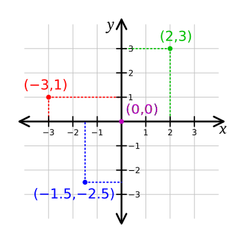

Two-dimensional points are represented as perpendicular distances from orthogonal axes, typically denoted as X and Y. For instance, (2,3) signifies a point 2 units from the y-axis and 3 units from the x-axis. If the coordinate axes are non-orthogonal, the point represents distances taken parallel to the axes.

  

In three dimensions, points are represented as distances from each of the three planes formed by the axes. For example, (2,3,4) represents a point 2 units from the YZ-plane, 3 units from the XZ-plane, and 4 units from the XY-plane.

Coordinates can be 'homogenized' by adding an extra value to the tuple. In three dimensions, points are represented as (x, y, z, w), which is equivalent to (x/w, y/w, z/w) in ordinary coordinates. This representation is commonly used in computer graphics as it facilitates expressing common operations, such as translation, as a linear product.